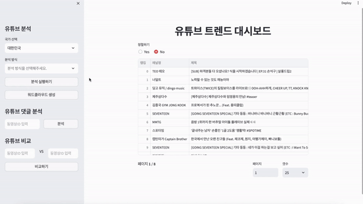
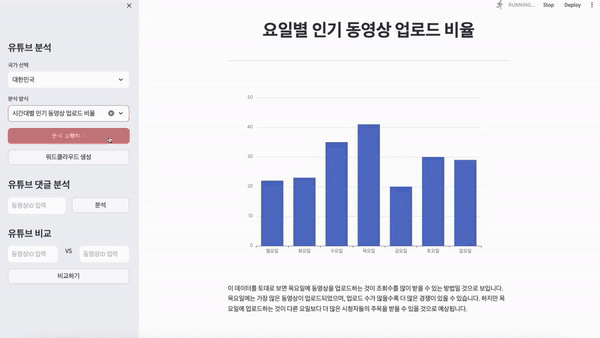
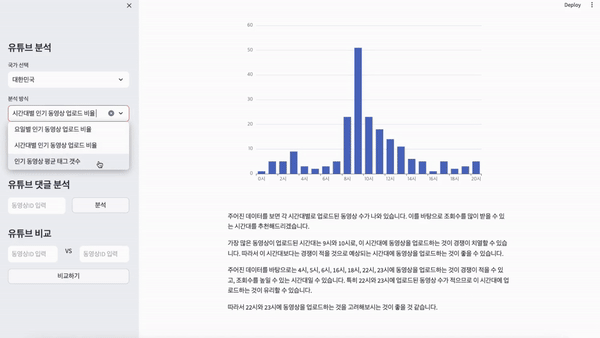
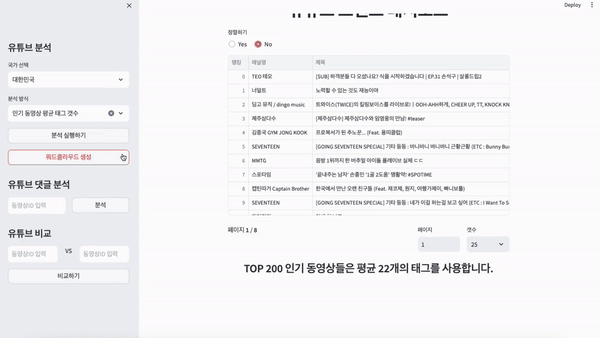
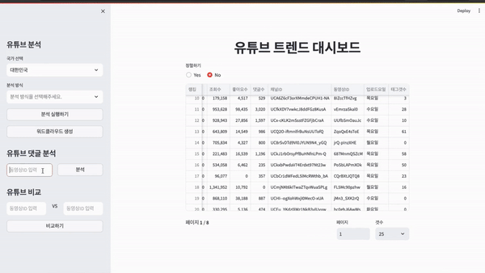
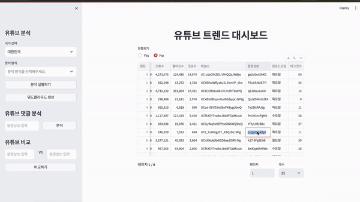

# 유튜브 트렌드 대시보드
[](https://opensource.org/licenses/Apache-2.0)
[](https://www.python.org/)
[](https://openai.com/)
[](https://hits.seeyoufarm.com)
[](https://makeapullrequest.com)

이 웹 애플리케이션은 YouTube의 인기 동영상 트렌드와 댓글을 분석 및 유튜브 동영상 비교하는 데 사용됩니다. 사용자는 높은 조회수를 얻을 수 있는 주제나 적절한 업로드 시기 등과 관련된 인사이트를 얻을 수 있습니다. 이를 위해 YouTube Data API v3를 활용하여 다양한 국가에서의 인기 동영상 순위를 가져오고, 업로드 패턴 그리고 동영상 댓글의 감정 분석 등의 기능을 제공합니다.

이 애플리케이션은 Python 언어를 기반으로 개발되었으며, 데이터 처리와 분석을 위해 Pandas 라이브러리를 중점적으로 사용합니다. 유튜브 댓글의 감정 분석을 수행하기 위해 사전 학습된 (matthewburke/korean_sentiment)모델을 활용하여 감정 평가를 제공합니다. 또한, 복잡한 데이터 분석 결과를 해석하고 사용자에게 의미 있는 인사이트를 전달하기 위해 OpenAI API를 활용합니다. Streamlit 라이브러리를 활용하여 직관적이고 사용자 친화적인 웹 인터페이스 제공합니다.

> (베타 버전) 특정 동영상의 욕설 횟수를 확인하여 해당 컨텐츠가 어린아이가 시청하기에 적합한 컨텐츠인지 알려주는 기능 추가

## 목차
1. [소개](#소개)
2. [구조](#구조)
3. [디자인 패턴](#디자인-패턴)
4. [간단한 기능 소개](#간단한-기능-소개)
5. [설치 방법](#설치-방법)
6. [사용 방법](#사용-방법)
7. [기능 모습 및 설명](#기능-모습-및-설명)
8. [사용된 기술](#사용된-기술)
9. [정보 및 라이센스](#정보-및-라이센스)

## 소개
**유튜브 트렌드 대시보드**는 최신 유튜브 트렌드를 쉽게 파악하고, 더 많은 조회수를 얻기 위한 최적의 업로드 시간과 주제를 고민하는 사용자들에게 유용한 정보를 제공하는 대시보드입니다. 이를 통해 사용자는 유튜브 상에서의 성공 가능성을 높이며, 트렌드에 맞춰 콘텐츠를 기획하고 발행할 수 있는 전략을 세울 수 있습니다. 올바른 주제 선정과 업로드 타이밍은 유튜브에서의 성공에 있어 결정적 요소입니다. 이 대시보드는 사용자가 이 두 가지를 최적화할 수 있게 하는 실질적인 데이터와 분석을 제공합니다.

## 구조
```
📦src
 ┣ 📂config
 ┃ ┣ 📜analysis_options.py
 ┃ ┣ 📜country_code.py
 ┃ ┗ 📜page_config.py
 ┣ 📂controllers
 ┃ ┗ 📜controller.py
 ┣ 📂models
 ┃ ┗ 📜model.py
 ┣ 📂utils
 ┃ ┣ 📜echart_generator.py
 ┃ ┣ 📜loading.py
 ┃ ┗ 📜sentiment_analysis.py
 ┣ 📂views
 ┃ ┗ 📜view.py
 ┗ 📜main.py
```

## 디자인 패턴
- ### 모델 (Model)
```model.py``` 에서는 YouTube Data API를 통해 인기 있는 동영상 데이터를 가져오고, 이를 처리하여 애플리케이션의 나머지 부분에 데이터를 제공합니다. 또한, 감정 분석(sentiment_analysis.py)과 같은 추가 데이터 처리 로직을 포함하여 데이터의 가공 및 분석을 담당합니다.
- ### 뷰 (View)
```view.py``` 에서는 Streamlit을 사용하여 사용자 인터페이스를 구성하고, 사용자로부터의 입력을 받아 모델로부터 데이터를 요청하며, 받은 데이터를 시각화하여 사용자에게 제공합니다.
- ### 컨트롤러 (Controller)
```controller.py``` 에서는 사용자의 요청에 따라 모델로부터 데이터를 요청하고, 그 데이터를 가공하여 뷰에 전달하는 역할을 합니다. 이를 통해 사용자의 입력에 기반한 로직 처리를 중앙에서 관리할 수 있습니다.


## 간단한 기능 소개
- **국가 선택:** 사용자는 국가를 선택하여 해당 지역의 인기 YouTube 동영상의 목록을 볼 수 있습니다.
- **인기 동영상 분석**: 정렬 및 페이징 기능이 포함된 인기 동영상 대시보드를 표시합니다.
- **분석 기능:** 요일별 또는 시간별 업로드 비율, 인기 동영상에 사용된 평균 태그 수 등의 분석 기능이 포함되어 있습니다.
- **워드 클라우드 시각화:** 인기 있는 동영상의 제목에서 워드 클라우드를 생성하여 공통 주제 또는 키워드에 대한 시각적 인사이트를 제공합니다.
- **동영상 댓글 분석:** 특정 동영상의 댓글에 대한 감정 분석을 수행하여 긍정 또는 부정 감정으로 분류합니다.
- **대화형 인터페이스:** 이 애플리케이션은 Streamlit을 사용하는 대화형 인터페이스를 제공하여 사용자가 다양한 분석 및 시각화를 쉽게 탐색할 수 있도록 제공합니다.
- **유튜브 비교:** 비교하고 싶은 두 개의 유튜브 동영상에 대한 정보를 비교하여 제공합니다.
- **(베타 버전)어린이 시청 적합 여부 판별 기능:** 특정 동영상의 욕설 횟수를 확인하여 해당 컨텐츠가 어린아이가 시청하기에 적합한 컨텐츠인지 알려줍니다.


## 설치 방법
1. 레포지토리 복제
```
git clone https://github.com/madEffort/youtube-trend-dashboard.git
```
2. 가상환경 생성
3. 필수 패키지 설치
```
poetry install
```
4. `.env` 파일 생성 및 환경변수 설정
```
YOUTUBE_API_KEY="*********************"
OPEN_API_KEY="***********************"
```
5. 애플리케이션 실행
```
streamlit run src/main.py
```


## 사용 방법

애플리케이션을 실행한 후 왼쪽의 대화형 사이드바를 따라 기능을 탐색합니다:

- 국가를 선택하여 해당 국가의 인기 Youtube 동영상을 확인합니다.
- 분석 옵션을 선택하고 `분석 실행하기`를 클릭하여 분석을 실행합니다.
- 워드클라우드를 생성하려면 `워드클라우드 생성하기` 버튼을 클릭합니다.
- 동영상 댓글 분석을 하려면 YouTube 동영상 ID를 입력하고 `분석하기`를 클릭합니다.
- 비교하고 싶은 두 개의 유튜브 동영상 ID를 입력하고 `비교하기` 버튼을 클릭합니다.

메인 패널에 데이터 시각화 및 댓글 분석 요약을 포함한 결과가 표시됩니다.

**동영상 테이블 사용법**
- 동영상들을 랭킹 순이 아닌 다른 순서로 보고 싶을경우 정렬하기 아래의 `Yes`를 체크합니다.
  - 원하는 정렬 기준을 선택하고 오름차순 혹은 내림차순을 선택합니다.
- 원하는 페이지를 입력합니다.
- 한 페이지에서 동영상을 몇 개 볼것인지 설정하려면 `갯수` 셀렉트 박스를 설정합니다.

```Tip) 사이드바에서 동영상 ID를 입력해야 할 때 동영상 ID를 찾아 복사하세요.```

## 기능 모습 및 설명

### 유튜브 분석
<table>
  <tr>
    <td colspan=2>
      <br>
      <b>분석 방식: 요일별 인기 동영상 업로드 비율</b><br>
      <br>
    </td>
  </tr>
  <tr>
	  <td align="center" width="50%">
		  
	  </td>
	  <td>
		  ➡ 월요일부터 일요일까지 요일별 인기 동영상 업로드 정보를 제공하고 OpenAI API를 활용하여 이를 분석하여 조회수를 많이 받을 수 있는 업로드 요일을 추천해줍니다. <br><br>
		  ➡ 로딩 중에는 streamlit 서드파티 라이브러리를 활용하여 사용자에게 로딩 모습을 보여줍니다.<br><br>
	  </td>
</table>
<table>
  <tr>
    <td colspan=2>
      <br>
      <b>분석 방식: 시간대별 인기 동영상 업로드 비율</b><br>
      <br>
    </td>
  </tr>
  <tr>
	  <td align="center" width="50%">
		  
	  </td>
	  <td>
		  ➡ 시간대별 인기 동영상 업로드 정보를 제공하고 OpenAI API를 활용하여 이를 분석하여 조회수를 많이 받을 수 있는 시간대를 추천해줍니다.
	  </td>
</table>
<table>
  <tr>
    <td colspan=2>
      <br>
      <b>분석 방식: 인기 동영상 평균 태그 갯수</b><br>
      <br>
    </td>
  </tr>
  <tr>
	  <td align="center" width="50%">
		  
	  </td>
	  <td>
		  ➡ YouTube의 Top 200 인기 동영상들이 사용한 태그 갯수의 평균을 계산해 정보를 제공해줍니다. 유저에게 영상을 업로드 할 때 태그를 몇 개를 써야할지 가이드 역할을 합니다.
	  </td>
</table>
<table>
  <tr>
    <td colspan=2>
      <br>
      <b>분석 방식: 워드클라우드 생성</b><br>
      <br>
    </td>
  </tr>
  <tr>
	  <td align="center" width="50%">
		  
	  </td>
	  <td>
		  ➡ 선택되어있는 국가의 YouTube에서 인기있는 주제와 키워드를 시각화하고 추천해줍니다.
	  </td>
</table>

### 유튜브 댓글 분석
<table>
  <tr>
    <td colspan=2>
      <br>
      <b>유튜브 댓글 분석</b><br>
      <br>
    </td>
  </tr>
  <tr>
	  <td align="center" width="50%">
		  
	  </td>
	  <td>
		  ➡ 동영상 ID를 입력받고 입력받은 동영상 ID에 해당하는 유튜브 동영상에 대한 댓글을 분석합니다. 
      댓글의 긍정적인 반응과 부정적인 반응의 비율을 사용자에게 제공합니다.<br><br>
      ➡ (Beta Version) 어린이 시청 적합 컨텐츠 판별 기능: 동영상 내에서 사용된 욕설의 횟수를 카운트하여 해당 영상이
      어린 아이가 시청하기에 적합한 컨텐츠인지 판별하여 사용자에게 알려줍니다.
	  </td>
</table>

### 유튜브 비교
<table>
  <tr>
    <td colspan=2>
      <br>
      <b>유튜브 비교</b><br>
      <br>
    </td>
  </tr>
  <tr>
	  <td align="center" width="50%">
		  
	  </td>
	  <td>
		  ➡ 두 개의 유튜브 동영상 ID를 입력받고 입력받은 동영상의 정보를 시각화하여 비교합니다.<br><br>
      ➡ 사용자는 조회수, 좋아요 수, 댓글 수, 사용한 태그, 업로드 날짜 및 요일, 동영상에 대한 여론(댓글) 반응 등을 한눈에 비교할 수 있습니다.
	  </td>
</table>

## 사용된 기술
- **Python:** 프로젝트의 핵심 프로그래밍 언어
- **Streamlit:** 웹 애플리케이션을 만드는데 사용
- **Pandas:** 데이터 조작 및 분석에 사용
- **Sentiment Analysis:** 사전 학습된 모델(matthewburke/korean_sentiment)을 활용하여 댓글을 긍정 또는 부정으로 분류하는데 사용
- **YouTube Data API v3:** 인기 동영상 데이터 및 댓글을 가져오는데 사용
- **Echarts 및 WordCloud:** 시각화 생성에 사용
- **YouTubeTranscriptApi:** 유튜브 자막을 가져오는데 사용 (베타 버전)
- **OpenAI API:** 데이터 분석에 대한 해석에 사용

이 프로젝트는 모델-뷰-컨트롤러(MVC) 아키텍처 디자인 패턴에 따라 구조화되었습니다.

## 정보 및 라이센스

MIT 라이센스를 준수하며 [LICENSE](https://github.com/madEffort/youtube-trend-dashboard/blob/main/LICENSE) 에서 자세한 정보를 확인할 수 있습니다.
